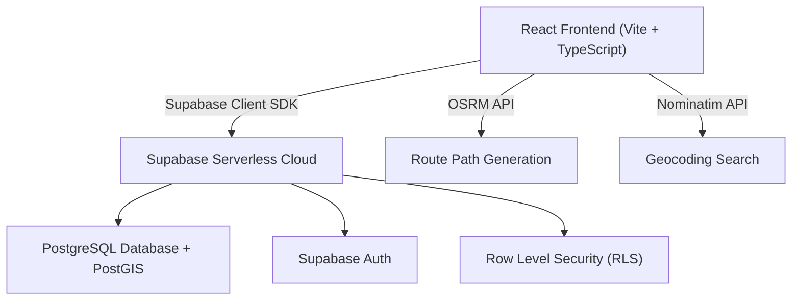

# ⚡ EV SmartNav — Driver Platform

An advanced, high-fidelity AI-powered EV navigation and journey planning application. EV SmartNav utilizes real-time geolocation, predictive charging analytics, and routing services to deliver a premium navigation experience for electric vehicle drivers.

Built with a modern serverless architecture, the system leverages **Supabase** for database management, authentication, and security, combined with **OpenStreetMap (Nominatim)** for geocoding and **OSRM** for live route rendering.

---

## 🚀 Key Features

* **AI Journey Planner**: Enter origin, destination, and custom waypoint stops. Dynamically calculates OSRM routes, total distance, ETA, and estimated trip costs.
* **Predictive Charging Analytics**: Displays real-time wait times, best charging slots (e.g., overnight/off-peak), and AI-driven demand warnings for nearby stations.
* **Live Interactive Map**: Powered by Leaflet and OpenStreetMap, plotting dynamic route coordinates, waypoints, and local charging points.
* **Vehicle Syncing & Telemetry**: Updates remaining estimated vehicle range automatically according to battery capacity and state of charge (SoC).
* **Weather & Terrain Adaptability**: Calculates and displays external energy penalties (e.g., rain, wind, or elevation changes) reducing overall battery performance.
* **Role-Based Security**: Complete driver, government, and station operator roles with secure row-level access control.
* **Stunning UI/UX**: Premium dashboard utilizing glassmorphism styling, ambient background video looping, and interactive state transitions.

---

## 🛠️ Architecture & Tech Stack



* **Frontend**: React (v19), TypeScript, Vite, Tailwind CSS, Framer Motion (animations), Lucide React (icons).
* **Mapping**: Leaflet, React-Leaflet, OpenStreetMap.
* **Backend & Database**: Supabase (PostgreSQL with PostGIS extensions).

---

## 📋 Directory Layout

```text
EV_Smart_Nav/
├── EV-SmartNav-Driver/
│   ├── backend/
│   │   └── database/
│   │       └── schema.sql        # Database tables, triggers, and seed data
│   └── frontend/
│       ├── public/               # Static assets & icons
│       ├── src/
│       │   ├── components/       # Reusable components (Map, Sidebar, etc.)
│       │   ├── context/          # Global Authentication Context
│       │   ├── lib/              # Supabase Client connection configuration
│       │   ├── pages/            # User Auth & Dashboard pages
│       │   └── App.tsx           # Router and main layout entrypoint
│       ├── .env.example          # Environment variables template
│       ├── package.json          # Frontend build & scripts configuration
│       └── vite.config.ts        # Vite tooling configurations
└── .gitignore                    # Global repository ignore file
```

---

## 🏁 How to Start the Project

Follow these steps to set up and run the application locally:

### 1. Database Setup (Supabase)
1. Go to [Supabase](https://supabase.com) and create a new project.
2. Navigate to your project's **SQL Editor** from the sidebar.
3. Open the file `EV-SmartNav-Driver/backend/database/schema.sql` from this repository, copy its contents, and run it in the SQL Editor.
   * *This will enable PostGIS, create all target tables (`profiles`, `vehicles`, `charging_stations`, `trips`, `gov_profiles`), configure auth-triggers, and seed Indian EV charging stations.*

### 2. Environment Configuration
1. Navigate to the frontend directory:
   ```bash
   cd EV-SmartNav-Driver/frontend
   ```
2. Duplicate the `.env.example` file and rename it to `.env`:
   ```bash
   copy .env.example .env
   ```
3. Open `.env` and fill in your Supabase project API credentials:
   ```env
   VITE_SUPABASE_URL=https://your-project-id.supabase.co
   VITE_SUPABASE_ANON_KEY=your-anon-api-key
   ```
   *(You can find these in the Supabase Dashboard under **Settings** → **API**)*

### 3. Install & Launch the Frontend
1. Make sure you are in the `frontend` folder:
   ```bash
   cd EV-SmartNav-Driver/frontend
   ```
2. Install the node package dependencies:
   ```bash
   npm install
   ```
3. Start the Vite local development server:
   ```bash
   npm run dev
   ```
4. Open the displayed URL in your browser (typically `http://localhost:5173`) to view and interact with the application.
